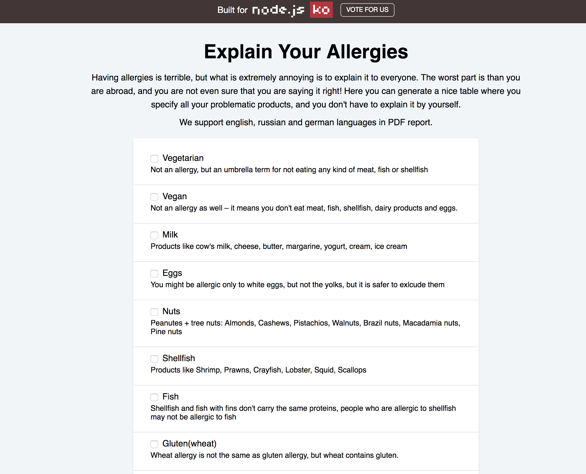

## Allergy checker

[](https://github.com/prettier/prettier)

This is a web application to list your allergies in English, Russian and German language, so you can carry it with you and show it to people abroad, and you don't have to worry whether this food is safe for you or that people misunderstood you.

<a href="https://nameless-hamlet-12227.herokuapp.com" target="_blank"></a>

## Running

This application was written using Node 11.0, but I think any modern version will work (definitely all LTS releases).

```sh
yarn install
npm start
```
